# ERD - Sơ đồ quan hệ hệ thống quản lý nhà trọ

```mermaid
erDiagram

    User {
        ObjectId _id PK
        string name
        string email
        string password
        string phone
        string address
        string avatar
        string role
        string accountType
        boolean isActive
        string codeId
        Date codeExpired
        string totalHouse
        string totalHousePackage
        ObjectId packageId FK
        Date fromDate
        Date toDate
        boolean status
        string totalMonth
        string payment
        string paymentUpdate
        boolean statusPayment
        boolean statusPaymentUpdate
        Date toDateUpdate
        string totalMonthUpdate
        string bank
        string bankAccount
        Date createdAt
        Date updatedAt
    }

    Package {
        ObjectId _id PK
        string code
        string name
        string description
        string price
        boolean isActive
        string totalBuilding
        Date createdAt
        Date updatedAt
    }

    Feature {
        ObjectId _id PK
        string code
        string name
        string systemRoles
        string path
        string description
        string displayName
        string menuCode
        Date createdAt
        Date updatedAt
    }

    PackageFeature {
        ObjectId packageId FK
        ObjectId featureId FK
    }

    Building {
        ObjectId _id PK
        string name
        string address
        number priceOfRoom
        number totalRooms
        number numberOfRoomsRented
        number numberOfPeopleRoom
        number rating
        number shippingPrice
        string income
        ObjectId userId FK
        Date createdAt
        Date updatedAt
    }

    Room {
        ObjectId _id PK
        string code
        string acreage
        boolean kitchen
        boolean toilet
        boolean washroom
        string totalPeople
        string price
        string totalMonth
        string payment
        boolean status
        ObjectId userId FK
        ObjectId buildingId FK
        Date fromDate
        Date toDate
        Date paymentsDate
        string statusPayment
        Date createdAt
        Date updatedAt
    }

    ElectricityBill {
        ObjectId _id PK
        string eletricPrice
        string amount
        string payment
        ObjectId roomId FK
        Date fromDate
        Date toDate
        string status
        Date createdAt
        Date updatedAt
    }

    WaterBill {
        ObjectId _id PK
        string waterPrice
        string amount
        string payment
        ObjectId userId FK
        ObjectId roomId FK
        Date fromDate
        Date toDate
        string status
        Date createdAt
        Date updatedAt
    }

    Vehicle {
        ObjectId _id PK
        string type
        string price
        string licensePlate
        string shippingPrice
        ObjectId userId FK
        ObjectId roomId FK
        Date fromDate
        Date toDate
        string status
        Date createdAt
        Date updatedAt
    }

    Blog {
        ObjectId _id PK
        string title
        string mainImage
        string introduce
        array Content
        string conclusion
        string rating
        ObjectId userId FK
        ObjectId buildingId FK
        Date createdAt
        Date updatedAt
    }

    Review {
        ObjectId _id PK
        Date creater_at
        string rating
        string comment
        string image
        string expression
        ObjectId userId FK
        ObjectId buildingId FK
        ObjectId blogId FK
        Date createdAt
        Date updatedAt
    }

    RepReview {
        ObjectId _id PK
        Date creater_at
        string comment
        string image
        string expression
        ObjectId userId FK
        ObjectId reviewId FK
        ObjectId repReviewId FK
        Date createdAt
        Date updatedAt
    }

    Offer {
        ObjectId _id PK
        string code
        string name
        string description
        string discountPercentage
        string discountCurrency
        Date deletedAt
        boolean isActive
        number condition
        Date createdAt
        Date updatedAt
    }

    %% ===================== RELATIONSHIPS =====================

    %% User - Package (User đăng ký 1 gói)
    Package ||--o{ User : "được đăng ký bởi"

    %% Package - Feature (gói có nhiều tính năng)
    Package ||--o{ PackageFeature : "có"
    Feature ||--o{ PackageFeature : "thuộc"

    %% User - Building (chủ nhà sở hữu nhiều toà nhà)
    User ||--o{ Building : "sở hữu"

    %% Building - Room (toà nhà chứa nhiều phòng)
    Building ||--o{ Room : "chứa"

    %% User - Room (người thuê thuê phòng)
    User ||--o{ Room : "thuê"

    %% Room - ElectricityBill (phòng có nhiều hoá đơn điện)
    Room ||--o{ ElectricityBill : "phát sinh"

    %% Room - WaterBill (phòng có nhiều hoá đơn nước)
    Room ||--o{ WaterBill : "phát sinh"

    %% User - WaterBill
    User ||--o{ WaterBill : "trả"

    %% Room - Vehicle (phòng có nhiều xe)
    Room ||--o{ Vehicle : "đậu xe"

    %% User - Vehicle (user sở hữu xe)
    User ||--o{ Vehicle : "sở hữu"

    %% User - Blog (user viết blog)
    User ||--o{ Blog : "viết"

    %% Building - Blog (blog viết về toà nhà)
    Building ||--o{ Blog : "được viết về"

    %% User - Review (user đánh giá)
    User ||--o{ Review : "đánh giá"

    %% Building - Review (toà nhà được đánh giá)
    Building ||--o{ Review : "được đánh giá"

    %% Blog - Review (blog được đánh giá)
    Blog ||--o{ Review : "nhận đánh giá"

    %% Review - RepReview (review có nhiều phản hồi)
    Review ||--o{ RepReview : "nhận phản hồi"

    %% User - RepReview (user phản hồi)
    User ||--o{ RepReview : "phản hồi"

    %% RepReview self-reference (phản hồi lồng nhau)
    RepReview ||--o{ RepReview : "trả lời"
```

## Chú thích quan hệ

| Quan hệ | Loại | Mô tả |
|---|---|---|
| User → Package | Many-to-One | Mỗi user đăng ký 1 gói dịch vụ |
| Package → Feature | Many-to-Many | Gói dịch vụ bao gồm nhiều tính năng |
| User → Building | One-to-Many | Chủ nhà sở hữu nhiều toà nhà |
| Building → Room | One-to-Many | Toà nhà chứa nhiều phòng |
| User → Room | One-to-Many | Người thuê có thể thuê nhiều phòng |
| Room → ElectricityBill | One-to-Many | Mỗi phòng có nhiều hoá đơn điện theo tháng |
| Room → WaterBill | One-to-Many | Mỗi phòng có nhiều hoá đơn nước theo tháng |
| Room → Vehicle | One-to-Many | Phòng có thể đăng ký nhiều xe |
| User → Blog | One-to-Many | User viết nhiều bài blog |
| Building → Blog | One-to-Many | Blog viết về toà nhà |
| User → Review | One-to-Many | User đánh giá nhiều toà nhà / blog |
| Review → RepReview | One-to-Many | Review nhận nhiều phản hồi |
| RepReview → RepReview | Self-reference | Phản hồi lồng nhau (reply) |
| Offer | Độc lập | Chưa liên kết với entity nào |
